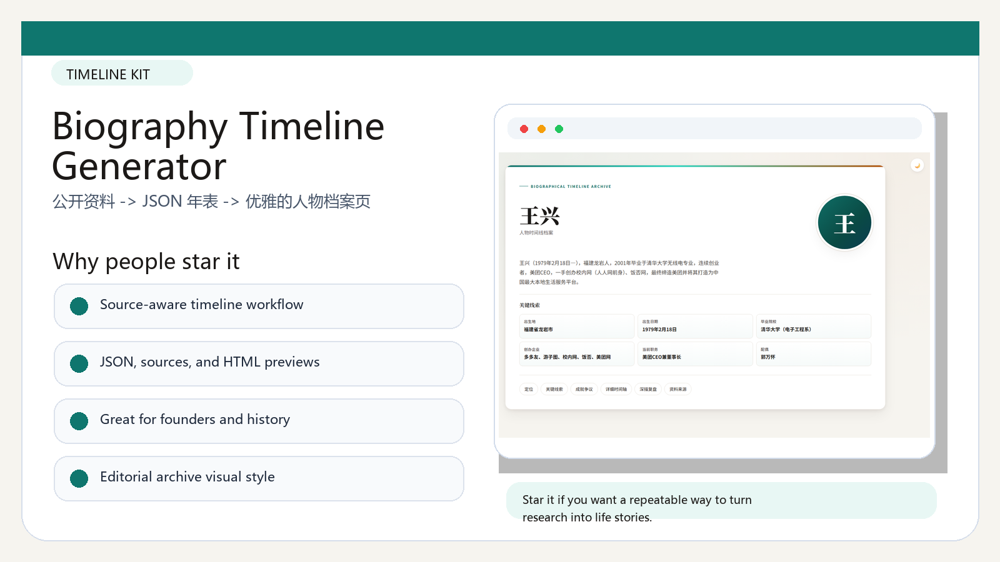
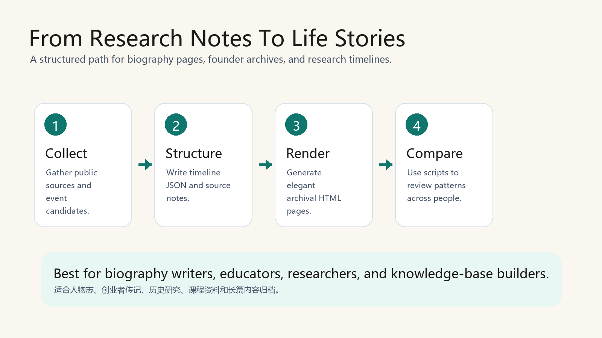

# OpenClaw Biography Timeline | 人物时间线生成器

A biography timeline toolkit for turning scattered public material into structured, source-aware life stories.

一个把人物资料整理成可核验时间线的工具包：适合人物志、创业者传记、历史研究、课程资料和长篇内容归档。


## Visual Tour | 图像导览

| Product Highlights | Build / Remix Flow |
|---|---|
|  |  |

## Why Star This | 为什么值得 Star

- Converts long-form research into JSON timelines, readable HTML previews, and source notes.
- Comes with templates, generation scripts, sample timelines, and an archival visual style.
- Useful for biography writers, educators, researchers, content teams, and knowledge-base builders.
- 不只是页面模板，而是一套“资料整理到人物年表”的工作流。

## What Is Inside | 项目内容

- `assets/archive-template.html`: editorial timeline template.
- `scripts/`: rendering, batch generation, research cache, portrait fetching, and comparison utilities.
- `preview/`: generated HTML timeline examples.
- `timelines/`: cleaned timeline JSON and source notes.

## Best Use Cases | 适合做什么

- Founder and entrepreneur timeline pages
- Historical figure archives
- Course material and reading notes
- Personal knowledge management
- 人物大事记、企业家年表、历史资料库、课程知识库

## Quick Start | 快速开始

```bash
python scripts/render_timeline.py
```

Open the generated HTML files in `preview/` or `scripts/`.

## Public Safety | 公开安全说明

Private deployment URLs, tokens, local state, and hosting identifiers were removed before publication.
