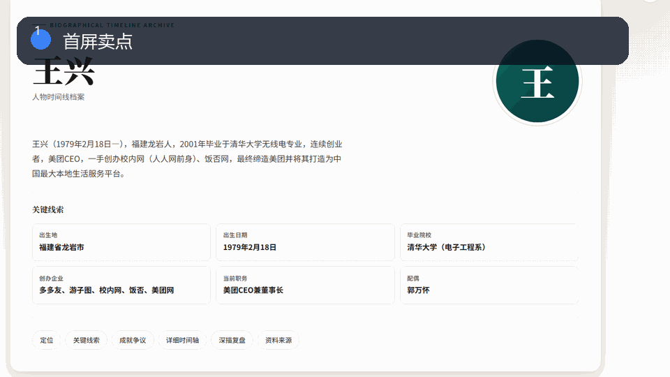
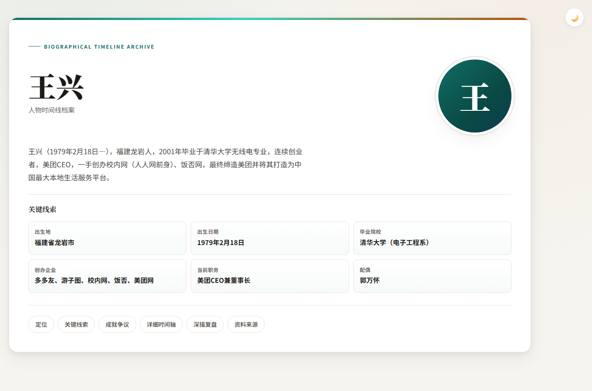
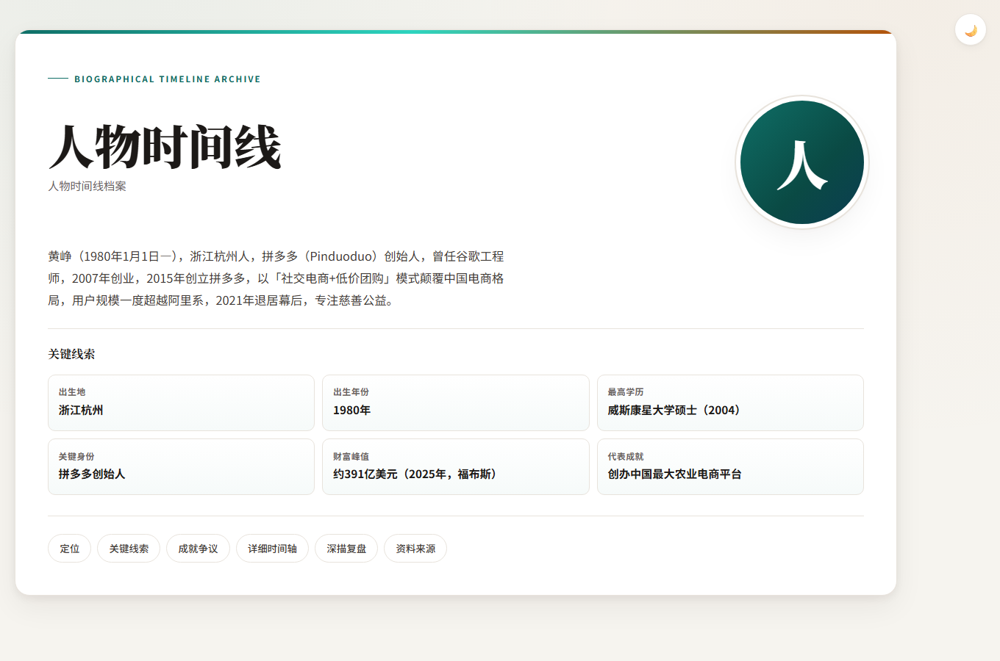
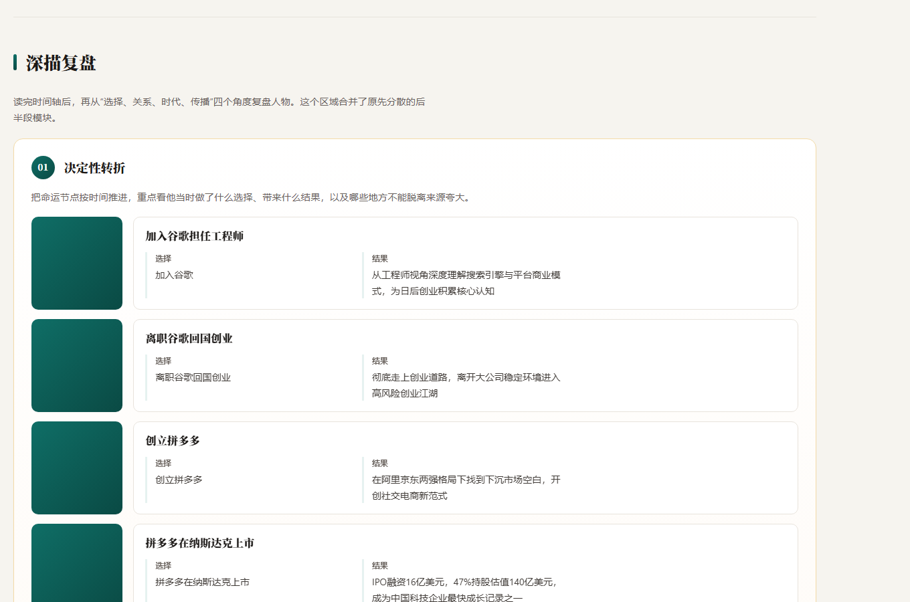
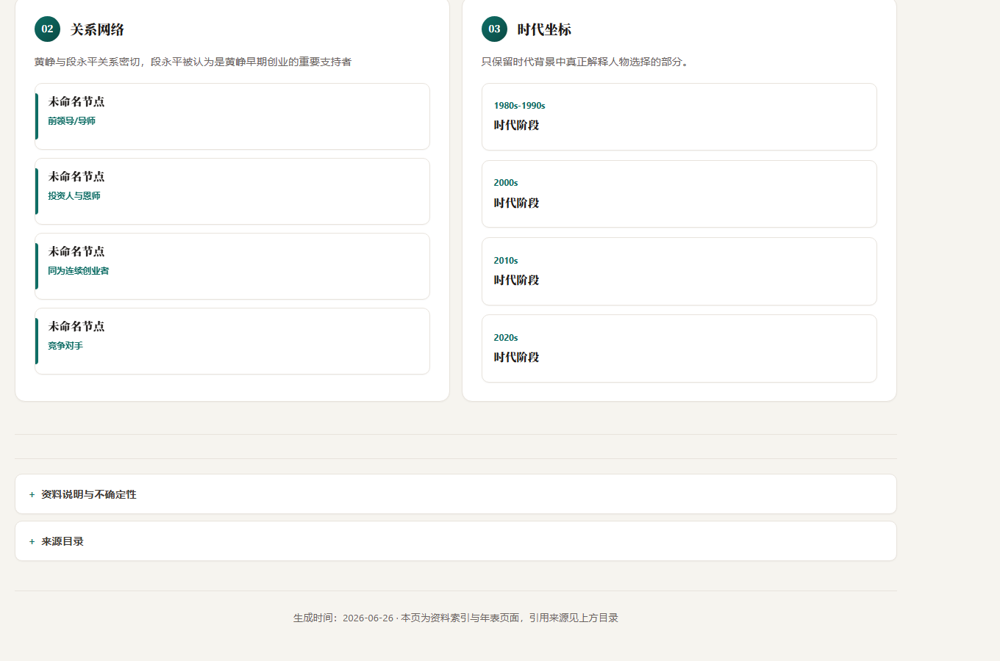

# OpenClaw 人物时间线生成器

一套把人物公开资料整理成结构化年表、来源说明和档案式网页的工具包，适合人物志、创业者传记、历史研究和内容知识库。

**English introduction:** [README_EN.md](README_EN.md)



## 一眼看懂

**把零散人物资料整理成时间线、关系网络和深度复盘页面**

- 适合人物志、创业者传记、历史研究、课程资料和内容知识库。
- 时间轴、关键线索、成就争议、关系网络、来源说明都已成型。
- 用 JSON 和模板即可持续扩展更多人物页面。

## 30 秒改成你的项目

Fork 后新增人物 JSON 和来源文件，再运行渲染脚本，就能生成自己的档案式人物页面。

> 喜欢这种可直接改造的产品模板，欢迎 Star。它能帮你以后少搭一次骨架，多留一点时间打磨自己的数据和内容。

## 页面截图

下面四张图都来自本仓库真实中文页面渲染：首屏、滚动后的第二屏，以及两个关键功能视图。它们不是概念图，也不是英文占位图，能直接看到项目实际运行后的样子。

| 首屏截图 | 第二屏截图 |
|---|---|
|  |  |
|  |  |

## 系统功能总览

这个系统解决的是“资料很多但难以阅读”的问题。它把人物经历拆成关键线索、详细时间轴、成就争议、深描复盘和资料来源，让一个人物从零散资料变成可发布、可核验、可继续扩展的档案页面。

## 核心功能

- **人物档案首屏**：展示人物简介、出生地、教育背景、代表身份、关键成就等信息。
- **关键线索卡片**：把人物最重要的身份、节点和标签集中展示，方便快速理解。
- **详细时间轴**：按事件顺序展示教育、职业、创业、上市、管理、慈善等人生节点。
- **事件分类筛选**：通过出生、教育、职业、创业、上市、成就、管理等标签过滤时间线。
- **成就与争议速览**：把正面成就和争议事件放在同一阅读结构里，避免单向叙事。
- **深描复盘模块**：从决定性转折、关系网络、时代坐标等角度复盘人物选择。
- **资料来源说明**：保留 source note 结构，方便后续补充引用、校验和出处。
- **批量生成脚本**：包含渲染、批量生成、人物数据库、研究缓存、头像抓取等脚本。
- **模板化输出**：通过 HTML 模板和 JSON 数据生成可独立发布的人物页面。

## 适合改造成什么

- 创业者人物志网站
- 历史人物档案库
- 企业家课程资料
- 长篇报道的资料整理页
- 个人知识管理中的人物研究系统

## 目录说明

- `assets/archive-template.html`：档案风格人物时间线模板。
- `scripts/`：生成、渲染、批处理、人物数据库和研究辅助脚本。
- `preview/`：已生成的人物时间线预览页面。
- `timelines/`：结构化时间线 JSON 和来源说明。

## 快速开始

```bash
python scripts/render_timeline.py
```

生成后可打开 `preview/` 或 `scripts/` 中的 HTML 页面查看效果。

## 公开安全说明

这个公开版本已经移除真实部署地址、生产密钥、Cloudflare token、本地环境文件、日志、`.wrangler`、`node_modules` 和任何不适合公开的私有信息。你可以放心把它当作学习、参考和二次开发的起点。

## 推荐 Star 的理由

如果你正在做类似产品，这个仓库不是只能看一眼的截图，而是能直接 Fork 的结构样板：页面、数据、组件、交互和说明文档都已经整理好，可以节省从 0 到 1 搭骨架的时间。
